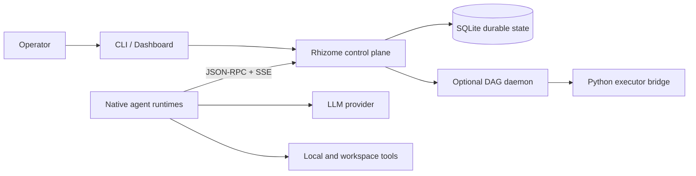

# Rhizome Runtime

**Durable coordination for autonomous agent teams.**

[](https://github.com/Rhizome-Project/rhizome-runtime/actions/workflows/ci.yml)
[](https://go.dev/)
[](LICENSE)
[](#research-preview)

> **Research Preview** — Rhizome Runtime is early, experimental software. APIs,
> schemas, configuration, and operational behavior may change without notice.
> It has not been evaluated for production or safety-critical workloads.

This repository is a public snapshot of an ongoing research codebase;
development history predates the public tree.

## Public research artifacts

- [Early Signal 01: autonomous build](https://github.com/Rhizome-Project/signal-01-autonomous-build)
  publishes a reproducible three-agent software build, its verification suite,
  release, run report, and explicit provenance boundary.
- [Rhizome Project](https://rhizome-project.com) contains the public system
  overview, research notes, and current Early Signals status.

Long-running agents need more than a prompt and a tool loop. They need durable
ownership, recoverable sessions, shared context, explicit evidence, and a place
to coordinate when processes restart or work crosses agent boundaries.

Rhizome Runtime is a local-first control plane and native agent runtime for
making those coordination mechanics explicit. Tasks, claims, sessions, shared
documents, memory, project state, tool policy, and escalation live in durable
SQLite state instead of disappearing with one model call.

## What ships

- **`rhizome`** — the control-plane CLI and HTTP service, with JSON-RPC, SSE,
  health endpoints, a dashboard, and a durable SQLite store.
- **`rhizome-bot`** — the native agent runtime: registration, heartbeats,
  planning, recovery, shared-memory synchronization, and governed tool use.
- **Optional DAG execution** — a server-side daemon and Python executor bridge
  for explicit node graphs. This is separate from the LLM-driven agent loop.

Rhizome currently focuses on:

- durable tasks, claims, sessions, events, and restart-aware execution;
- shared documents, memory, artifacts, messages, and agent updates;
- explicit project, branch, review, and tool-governance workflows;
- native multi-agent coordination with persistent runtime identity;
- observable local operation through CLI, JSON-RPC, SSE, and dashboard views.

## Quick start

Prerequisites: Git and Go 1.26.1 or newer. Python 3 is needed only for the optional
DAG executor bridge.

Build both binaries:

```bash
git clone https://github.com/Rhizome-Project/rhizome-runtime.git
cd rhizome-runtime
mkdir -p bin data

go build -o bin/rhizome ./cmd/rhizome
(
  cd agent
  go build -o ../bin/rhizome-bot .
)
```

Start the control plane in the first terminal:

```bash
export RHIZOME_DB="$PWD/data/rhizome.db"
export RHIZOME_WORKSPACE_ROOT="$PWD/data/workspace"
export RHIZOME_WORKSPACE_ID="rhizome-main"
export RHIZOME_WORKSPACE_PASSWORD="replace-with-a-long-random-value"

./bin/rhizome serve --addr 127.0.0.1:8420
```

Open <http://127.0.0.1:8420/dashboard> or check the service with
`curl --fail http://127.0.0.1:8420/health`.

In a second terminal, start a deterministic local agent. The `fake` backend
exercises registration, polling, task ownership, and durable state transitions
without sending data to an external model provider. It is a runtime smoke path,
not a model-quality evaluation:

```bash
export RHIZOME_WORKSPACE_PASSWORD="replace-with-a-long-random-value"

./bin/rhizome-bot daemon \
  --workdir "$PWD/data/agents/researcher" \
  --rhizome-host http://127.0.0.1:8420 \
  --workspace-id rhizome-main \
  --agent-id researcher \
  --display-name "Researcher" \
  --owner-user-id local-user \
  --llm-backend fake
```

In a third terminal, submit and inspect a task against the same database:

```bash
export RHIZOME_DB="$PWD/data/rhizome.db"

./bin/rhizome task submit \
  --task-id demo-001 \
  --owner-user-id local-user \
  --workspace-id rhizome-main \
  --title "Create a workspace research note" \
  --description "Summarize the current workspace state and publish the result as a shared document." \
  --kind EXECUTION

./bin/rhizome task status --task-id demo-001
```

The first startup requires `RHIZOME_WORKSPACE_PASSWORD`; Rhizome never ships a
shared bootstrap password. Keep the same value in the second terminal when
registering an agent. Secrets are read from environment variables or protected
local profiles, not command-line flags.

See [Getting Started](docs/getting-started.md) for the agent and task walkthrough,
PowerShell commands, cleanup, troubleshooting, and a separately bounded real
provider example.

## Architecture



The current design is single-node and local-first. Agent processes are external
workers; the control plane remains the canonical coordination record. Read the
[Architecture Overview](docs/architecture.md) for boundaries and recovery
behavior.

## Research preview

This repository is intended for hands-on evaluation and collaborative
development. Important current boundaries:

- no high-availability or distributed-consensus claim;
- no hostile multi-tenant isolation or untrusted-code sandbox;
- no built-in TLS termination;
- schemas and public interfaces may change before a stable release.

“Research Preview” describes maturity, not a field-of-use restriction. Rhizome
Runtime is licensed under **AGPL-3.0-only**; commercial use is permitted subject
to that license.

## Documentation

- [Getting Started](docs/getting-started.md)
- [Architecture Overview](docs/architecture.md)
- [Security Model](docs/security-model.md)
- [Roadmap](ROADMAP.md)
- [Contributing](CONTRIBUTING.md)
- [Security Policy](SECURITY.md)

## License

Project code is available under the [GNU Affero General Public License v3.0](LICENSE).
Vendored assets and dependency notices are documented in
[THIRD_PARTY_NOTICES.md](THIRD_PARTY_NOTICES.md).

Distributed builds expose a corresponding-source link in both dashboards. If
you publish a modified build, set `RHIZOME_SOURCE_URL` to the exact public source
tree or revision for that build.
