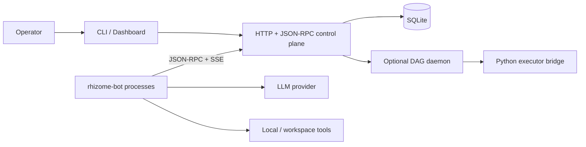

# Architecture overview

Rhizome Runtime separates durable coordination state from the processes that
act on it. The server owns the canonical record; agents and optional executors
advance work through explicit contracts.

## Runtime topology

## Control plane

`cmd/rhizome` is the operator CLI and service entrypoint. `internal/server`
provides the HTTP surface, JSON-RPC dispatch, authentication, rate limiting,
SSE event delivery, health/readiness endpoints, and dashboard. Workspaces,
tasks, sessions, claims, projects, tool policy, budgets, messages, and memory
are represented explicitly instead of being inferred from a process log.

## Persistence and authority

`internal/storage/sqlite` owns schema migrations and durable writes. The store
uses a serialized write connection and a read pool. Runtime events, authority
leases, fencing data, and transition evidence make recovery decisions visible
after a process restart.

The current release is a single-node, local-first design. Authority records
guard important transitions, but they are not a distributed-consensus system
and do not provide high availability.

## Native agent runtime

The separate `agent/` module builds `rhizome-bot`. After registration and
bootstrap, the runtime maintains concurrent heartbeat, event, message, request,
internal-heartbeat, planner, watchdog, and memory-synchronization loops. Local
scratch, inbox, and memory files help recovery; the server remains the
canonical source for shared coordination truth.

The agent can use an OpenAI-compatible API or supported local CLI backend.
Tools are assembled from local capabilities plus workspace-governed tool
definitions. Project and branch operations are explicit coordination objects,
not an implicit shared-working-tree convention.

## Two execution paths

Rhizome contains two distinct execution mechanisms:

1. The native agent loop uses a model and tools to work on durable tasks.
2. The optional DAG daemon executes explicit graph nodes through
   `internal/executor/rpc_bridge.py` and its Python runtime contracts.

They share persistence and coordination surfaces but have different scheduling
and failure behavior.

## Failure and recovery

- Tasks, claims, sessions, runtime events, and agent state survive process
  restart in SQLite.
- Agents re-bootstrap, reconcile cursors, and resume from durable server state.
- Heartbeats and watchdogs expose stalled or missing processes.
- Authority leases and revision checks reject stale writers on guarded paths.
- Explicit blocked/escalation states preserve work that cannot proceed safely.

These mechanisms improve observability and restart behavior; they do not imply
exactly-once execution for arbitrary external side effects.

## Source map

- `cmd/rhizome` — CLI dispatch and HTTP service lifecycle
- `internal/server` — HTTP, JSON-RPC, SSE, dashboard, authentication
- `internal/storage/sqlite` — schema, persistence, authority-backed writes
- `internal/daemon` — explicit DAG scheduling loop
- `internal/transport/rpc` — executor bridge contracts
- `internal/executor` — Python executor implementation and fixtures
- `agent` — native model-driven agent runtime
